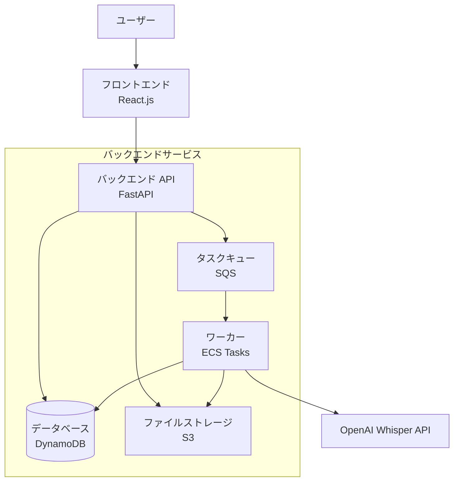

# アーキテクチャ設計書

## 1. システムアーキテクチャ

### 1.1 全体構成

### 1.2 コンポーネント構成

#### 1.2.1 フロントエンド
- React.js (TypeScript)
- 音声ファイルアップロード UI
- 処理状況表示
- 結果表示・編集画面

#### 1.2.2 バックエンド
- FastAPI (Python)
- ファイルアップロード処理
- 文字起こしジョブ管理
- RESTful API提供

#### 1.2.3 文字起こしサービス
- OpenAI Whisper API
- バッチ処理キュー（SQS）
- ECS Tasks（非同期処理）

#### 1.2.4 データベース（DynamoDB）
- **Usersテーブル**
  - PK: user_id (String)
  - 属性: email, name, created_at, usage_count
- **Jobsテーブル**
  - PK: job_id (String)
  - SK: user_id (String)
  - 属性: status, file_name, file_size, created_at, completed_at
  - GSI: user_id-created_at-index（ユーザー別履歴検索用）
- **Resultsテーブル**
  - PK: job_id (String)
  - 属性: transcript_text, timestamps, file_url, created_at

#### 1.2.5 ファイルストレージ
- AWS S3
- 音声ファイル一時保存
- 処理結果ファイル保存

### 1.3 処理フロー

1. ユーザーが音声ファイルをアップロード
2. ファイルをストレージに保存
3. 文字起こしジョブをキューに追加
4. バックグラウンドで文字起こし処理実行
5. 処理結果をデータベースに保存
6. ユーザーに完了通知
7. 結果表示・ダウンロード

## 2. 技術スタック

### 2.1 推奨技術スタック

#### フロントエンド
- React.js + TypeScript
- Vite (ビルドツール)
- Tailwind CSS (スタイリング)
- React Query (状態管理)

#### バックエンド
- FastAPI (Python)
- boto3 (AWS SDK)
- Pydantic (データバリデーション)
- aiobotocore (非同期DynamoDB操作)

#### 文字起こし
- OpenAI Whisper API
- SQS (メッセージキュー)
- ECS Tasks (バッチ処理)

#### データベース
- DynamoDB

#### インフラ
- Docker + Docker Compose
- AWS S3 (ファイルストレージ)
- AWS DynamoDB (データベース)
- AWS SQS (メッセージキュー)
- AWS ECS (バッチ処理)

### 2.2 開発環境
- Python 3.11+
- Node.js 18+
- Docker Desktop
- VS Code