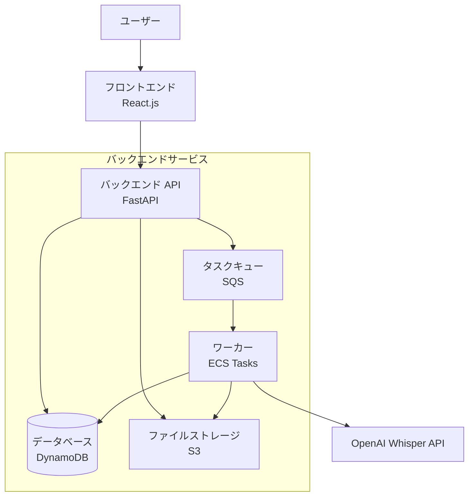

# アーキテクチャ設計書

## 1. システムアーキテクチャ

### 1.1 全体構成

### 1.2 コンポーネント構成

#### 1.2.1 フロントエンド
- React.js (TypeScript)
- 音声ファイルアップロード UI
- 処理状況表示
- 結果表示・編集画面

#### 1.2.2 バックエンド
- FastAPI (Python)
- ファイルアップロード処理
- 文字起こしジョブ管理
- RESTful API提供

#### 1.2.3 文字起こしサービス
- OpenAI Whisper API
- バッチ処理キュー（SQS）
- ECS Tasks（非同期処理）

#### 1.2.4 データベース（DynamoDB）
- **batch-voice-users テーブル**
  - PK: user_id (String)
  - 属性: email, created_at, updated_at
- **batch-voice-jobs テーブル**
  - PK: job_id (String)
  - 属性: user_id, file_name, file_path, status, created_at, updated_at, completed_at, error_message
  - GSI: user_id-created_at-index（ユーザー別履歴検索用）
- **batch-voice-results テーブル**
  - PK: result_id (String)
  - 属性: job_id, transcription, confidence_score, created_at

#### 1.2.5 ファイルストレージ
- AWS S3 (LocalStack: batch-voice-files バケット)
- 音声ファイル一時保存
- 処理結果ファイル保存

### 1.3 処理フロー

1. ユーザーが音声ファイルをアップロード
2. ファイルをストレージに保存
3. 文字起こしジョブをキューに追加
4. バックグラウンドで文字起こし処理実行
5. 処理結果をデータベースに保存
6. ユーザーに完了通知
7. 結果表示・ダウンロード

## 2. 技術スタック

### 2.1 推奨技術スタック

#### フロントエンド
- React.js + TypeScript
- Vite (ビルドツール)
- Tailwind CSS (スタイリング)
- React Query (状態管理)

#### バックエンド
- FastAPI (Python)
- boto3 (AWS SDK)
- Pydantic (データバリデーション)
- aiobotocore (非同期DynamoDB操作)

#### 文字起こし
- OpenAI Whisper API
- SQS (メッセージキュー)
- ECS Tasks (バッチ処理)

#### データベース
- DynamoDB

#### インフラ
- Docker + Docker Compose
- AWS S3 (ファイルストレージ)
- AWS DynamoDB (データベース)
- AWS SQS (メッセージキュー)
- AWS ECS (バッチ処理)

### 2.2 開発環境
- Python 3.11+
- Node.js 18+
- Docker Desktop
- VS Code
- LocalStack (AWS エミュレーション)

### 2.3 実装済みコンポーネント

#### バックエンドAPI (完了)
- FastAPI + uvicorn
- 実装済みエンドポイント:
  - `GET /api/health` - ヘルスチェック
  - `POST /api/jobs` - ファイルアップロード・ジョブ作成
  - `GET /api/jobs/{job_id}` - ジョブ状態確認
- AWS SDK統合 (boto3/aiobotocore)
- LocalStack連携設定

#### データベース (完了)
- DynamoDB テーブル設計・実装
- Python モデルクラス実装
- CRUD操作対応

#### ファイルストレージ (完了)  
- S3アップロード機能実装
- マルチパート対応
- ファイル形式検証

#### メッセージキュー (完了)
- SQS ジョブ投入機能
- 文字起こし処理ワーカー連携準備

#### 開発環境 (完了)
- Docker + Docker Compose 設定
- LocalStack 自動セットアップ
- Makefile による開発コマンド