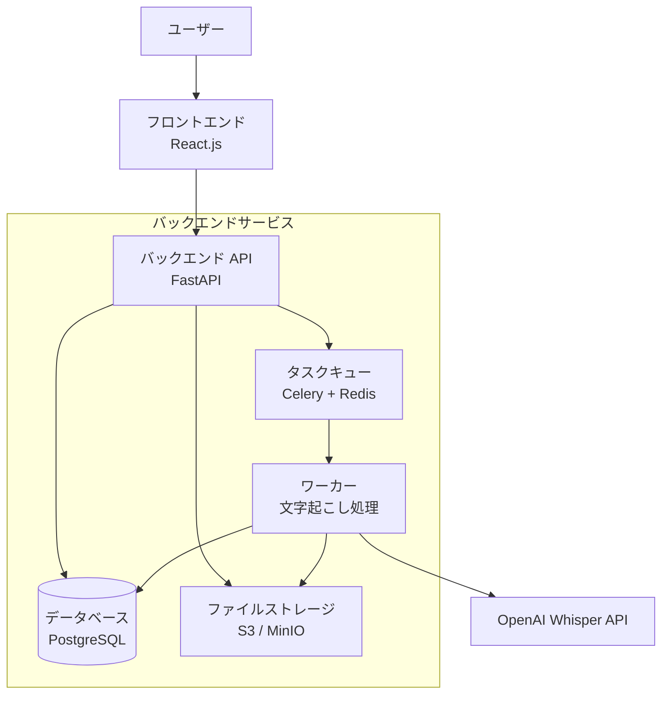

# 音声ファイル文字起こしWebアプリケーション 基本設計書

## 1. プロジェクト概要

### 1.1 目的
音声ファイルをアップロードし、AIによる文字起こしをバッチ処理で実行するWebアプリケーションを開発する。

### 1.2 システム名
batch-voice

### 1.3 対象ユーザー
- 会議録音の文字起こしが必要な企業・個人
- インタビューやポッドキャストの文字起こしが必要なコンテンツ制作者
- 音声コンテンツのアクセシビリティ向上を目指す組織

## 2. システム要件

### 2.1 機能要件

#### 2.1.1 音声ファイルアップロード機能
- 対応フォーマット：MP3, WAV, M4A, FLAC
- 最大ファイルサイズ：100MB
- 複数ファイルの同時アップロード対応
- ドラッグ&ドロップによるアップロード

#### 2.1.2 文字起こし処理機能
- バッチ処理による非同期実行
- 処理キューの管理
- 処理状況の表示（待機中、処理中、完了、エラー）
- 音声の言語自動検出

#### 2.1.3 結果表示・管理機能
- 文字起こし結果の表示
- タイムスタンプ付きテキスト
- 結果の編集機能
- 結果のダウンロード（TXT, SRT, VTT形式）

#### 2.1.4 ユーザー管理機能
- ユーザー登録・認証
- 処理履歴の管理
- 使用量の制限・監視

### 2.2 非機能要件

#### 2.2.1 性能要件
- 同時処理数：最大10ファイル
- 1時間の音声ファイル処理時間：10分以内
- レスポンス時間：Web UI操作は3秒以内

#### 2.2.2 可用性要件
- システム稼働率：99%以上
- 障害時の復旧時間：24時間以内

#### 2.2.3 セキュリティ要件
- アップロードファイルの暗号化
- 認証・認可の実装
- 処理完了後のファイル自動削除

## 3. システムアーキテクチャ

### 3.1 全体構成

### 3.2 コンポーネント構成

#### 3.2.1 フロントエンド
- React.js (TypeScript)
- 音声ファイルアップロード UI
- 処理状況表示
- 結果表示・編集画面

#### 3.2.2 バックエンド
- FastAPI (Python)
- ファイルアップロード処理
- 文字起こしジョブ管理
- RESTful API提供

#### 3.2.3 文字起こしサービス
- OpenAI Whisper API
- バッチ処理キュー（Celery + Redis）
- 非同期処理管理

#### 3.2.4 データベース
- PostgreSQL
- ユーザー情報
- ジョブ情報
- 処理結果メタデータ

#### 3.2.5 ファイルストレージ
- AWS S3 / MinIO
- 音声ファイル一時保存
- 処理結果ファイル保存

### 3.3 処理フロー

1. ユーザーが音声ファイルをアップロード
2. ファイルをストレージに保存
3. 文字起こしジョブをキューに追加
4. バックグラウンドで文字起こし処理実行
5. 処理結果をデータベースに保存
6. ユーザーに完了通知
7. 結果表示・ダウンロード

## 4. 技術スタック

### 4.1 推奨技術スタック

#### フロントエンド
- React.js + TypeScript
- Vite (ビルドツール)
- Tailwind CSS (スタイリング)
- React Query (状態管理)

#### バックエンド
- FastAPI (Python)
- SQLAlchemy (ORM)
- Alembic (マイグレーション)
- Pydantic (データバリデーション)

#### 文字起こし
- OpenAI Whisper API
- Celery (タスクキュー)
- Redis (メッセージブローカー)

#### データベース
- PostgreSQL

#### インフラ
- Docker + Docker Compose
- AWS S3 / MinIO (ファイルストレージ)

### 4.2 開発環境
- Python 3.11+
- Node.js 18+
- Docker Desktop
- VS Code

## 5. 開発計画

### 5.1 フェーズ1：基盤構築
- プロジェクト環境セットアップ
- データベース設計・構築
- 基本的なAPI設計

### 5.2 フェーズ2：コア機能開発
- ファイルアップロード機能
- 文字起こし処理機能
- 基本的なフロントエンド画面

### 5.3 フェーズ3：機能拡張
- ユーザー管理機能
- 処理履歴管理
- 結果編集機能

### 5.4 フェーズ4：運用準備
- テスト実装
- デプロイ環境構築
- 監視・ログ設定

## 6. 留意事項

### 6.1 セキュリティ
- アップロードファイルのウイルスチェック
- 個人情報を含む音声ファイルの取り扱い
- API レート制限の実装

### 6.2 コスト管理
- 文字起こしAPI使用料の管理
- ストレージ使用量の監視
- 処理時間の最適化

### 6.3 拡張性
- 他の文字起こしサービスとの連携
- 多言語対応
- 音声品質向上機能の追加